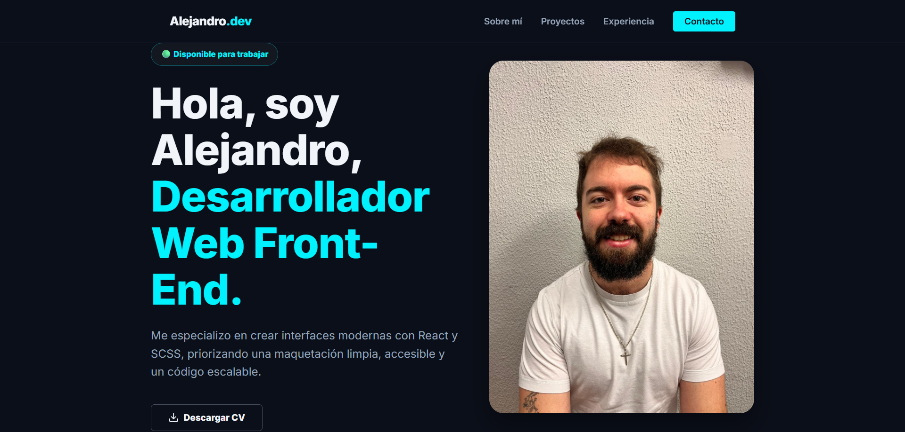

# 👨‍💻 Portfolio Frontend | Alejandro Luis Rey

> Mi espacio personal en la web para mostrar mi experiencia, proyectos y habilidades como Desarrollador Frontend.

🔗 **[Visita la Live Demo aquí](https://alejandroluisreydev.github.io/portfolio/)** 


## 🚀 Sobre el Proyecto

Este portfolio ha sido diseñado y desarrollado desde cero con un enfoque especial en el rendimiento, la accesibilidad y las buenas prácticas de maquetación web. He evitado el uso de frameworks pesados para demostrar un dominio sólido de las bases del desarrollo Frontend (Vanilla).

### ✨ Características Principales
- **Diseño Responsive:** Adaptable a cualquier dispositivo mediante metodologías *Mobile First*.
- **Arquitectura Escalable:** Uso del patrón 7-1 en SCSS para un código modular y mantenible.
- **Metodología BEM:** Clases CSS estructuradas mediante Block, Element, Modifier para evitar colisiones y mejorar la legibilidad.
- **Iconografía Optimizada:** Uso de SVGs en línea (sin librerías externas) para maximizar el rendimiento.
- **Cuadrículas Dinámicas:** Layouts construidos nativamente con CSS Grid y Flexbox.

## 🛠️ Stack Tecnológico

- **HTML5** (Estructura semántica)
- **CSS3 / SCSS** (Preprocesador)
- **JavaScript** (ES6+)
- **Git & GitHub** (Control de versiones y Despliegue)

## 💻 Instalación y Uso Local

Si deseas clonar y explorar el código de este proyecto en tu entorno local:

1. Clona el repositorio:
   ```bash
   git clone [https://github.com/AlejandroLuisReyDEV/portfolio](https://github.com/AlejandroLuisReyDEV/portfolio)
    ```
2. Abre el proyecto en tu editor de código (ej. VS Code).

3. Asegúrate de tener instalada la extensión Live Sass Compiler para compilar los estilos si deseas hacer cambios.

4. Lanza el servidor local usando Live Server abriendo el archivo index.html.

## 📫 Contacto

- LinkedIn: [\[Alejandro Luis Rey\]](https://www.linkedin.com/in/alejandroluisreydev/)

- Email: alexrey585@gmail.com